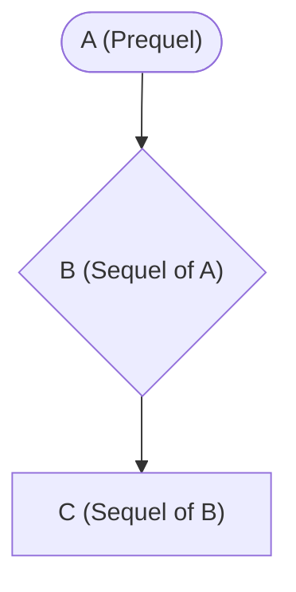
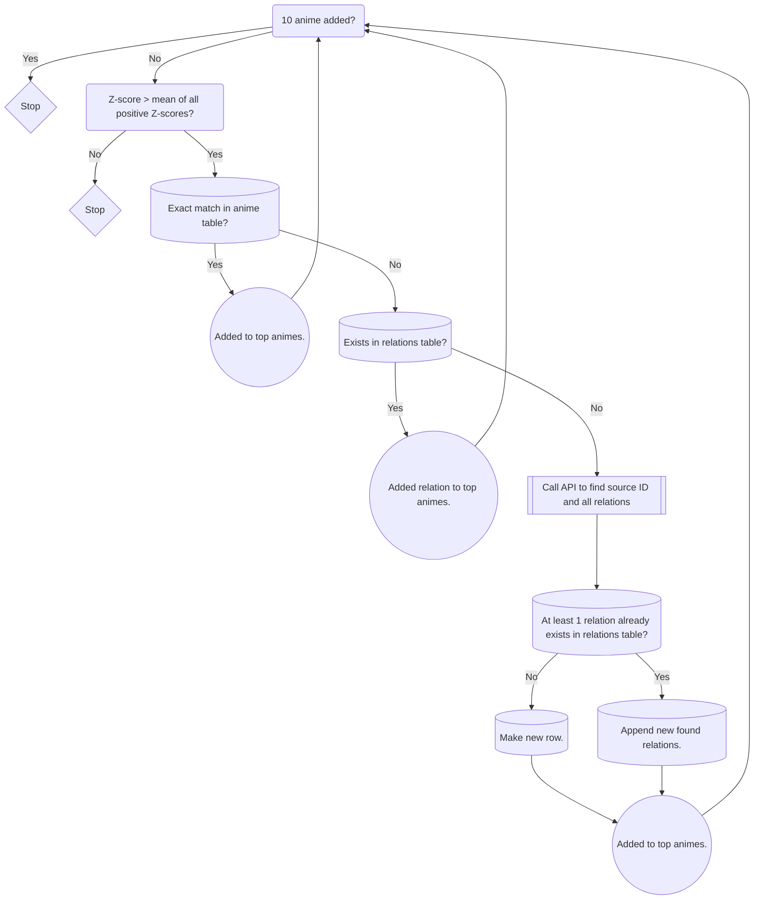

## About


Anirec is a full-stack project that utilizes item-to-item collaborative and content-based filtering to recommend anime.

The user can choose between three categories to be recommended by:

* Anime
	* Query a specific anime and receive recommendations that are similar to said anime.
* Genre
	* Query a specific genre (or genres) and receive recommendations of the highest rated anime that meet the specifications.
* User
	* Input a MyAnimeList profile and receive tailored recommendations that consider the user's preferred genres and highest scored anime.


## Made With


>[!NOTE]
>The code for the backend can be found in a [separate repository](https://github.com/j-chowder/anime-recommendation-backend).

## Data 

### Data Collection

Used [Anime Dataset 2023](https://www.kaggle.com/datasets/dbdmobile/myanimelist-dataset/data?select=anime-dataset-2023.csv) to get info of anime as well as user ratings of anime.

Used [Jikan API](https://jikan.moe/) to obtain data (namely genre and relation data) that the Anime Dataset 2023 lacked.

Used the [official MyAnimeList API](https://myanimelist.net/apiconfig/references/api/v2) to obtain user profiles in order to access their anime list.

### Data Cleaning & Preprocessing

Dropped shows that
* were duplicate
* had an unknown total score
* had a total score of 6 or lower.
	* The mode of the frequency of scores is the range 6.20 - 6.56. It felt inappropriate to recommend anime below that.

Dropped ratings that
* were on shows not present in the `anime` table.
	* cascading delete with foreign key in `ratings` table.
* were from users with less than 10 ratings in total.
	* This helps ensure the quality of determinating similarity between users.
	* Multiple ratings from a user ensures that they are useful pieces of data: trends, patterns, and their metrics (like what rating distinguishes from amazing/great/good) need sufficient sample sizes to be able to properly determine.

#### Relations
---
**Situation:**

MyAnimeList separates anime into individual seasons -- a prequel and a sequel will not count as one anime, but two. 

For the purpose of this project, there was little point in recommending a sequel of an anime over, say, the **franchise** as a whole. Instead of recommending "Kizumonogatari," it would be much better to recommend either (1) the first season of the franchise, "Bakemonogatari," or (2) the name of the franchise as a whole, "Monogatari Series." This is especially important for franchises with multiple seasons and/or relations, like the Fate Series. This is because:

- the Sequel Effect (as a series continues, the rating for later seasons tend to go up) will skew data and make it less reliable. Users who liked the first season will naturally watch the second season, and have a much higher likelihood to like the second season as well.
- Animes in the same franchise will inherently be similar so recommending a sequel is often redundant and ineffective. However, the bigger issue is that item-to-item collaborative filtering will skew towards these related anime (as they should).
    - _There are exceptions, like "Vinland Saga" Seasons 1 and 2, or "Attack on Titan" Seasons 1-3 and 4, where there are drastic differences between seasons, but they are few and far between._

---
**Task:**

**Clean up the data so that all entries were unique franchises.**

---
**Action:**

Calling the [Jikan API](https://jikan.moe/) with ``https://api.jikan.moe/v4/anime/{id}/relations`` lists out all relations of said anime.


 
The API only lists immediate relations of an anime. So `A`'s only relation would be  `B` -- and `C` would not be listed. In order to get `C`, I had to then call the API with `B`.

So, I recursively checked all relations of a franchise until all possible anime of a tree were checked.

Originally, I had removed every anime except for the ones that either (1) don't have relations (meaning they are the sole anime in the franchise), or (2) are prequels. This would ensure that side stories, character stories, and sequels would be removed -- making each entry unique and pertaining to a unique anime franchise.

> An issue with this approach was that prequels were not based off of **release date** but rather based on its position **chronologically, in context of the story**. I.e. "Jujutsu Kaisen 0" is the prequel of "Jujutsu Kaisen" despite the former releasing after the latter.

> There were also edge cases like "Fullmetal Alchemist" and "Fullmetal Alchemist: Brotherhood" not being related, or "Hunter x Hunter" and "Hunter x Hunter (2011)" being "alternative versions". In both of these cases, the prequel approach would not work.

As a result, I resorted to only keeping the entry that was the most popular (popularity = amount of people that put it on their lists). This ensured that I was getting the most relevant entry of the franchise.

> But, this still had lots of edge cases that made it ultimately ineffective. One case in particular was collaboration/crossover anime, one being "Isekai Quartet" that was a collaboration between several popular Isekai anime:  "Konosuba", "Overlord", "Re:Zero", and "The Saga of Tanya the Evil". Due to my recursive approach, and because "Isekai Quartet" had each of the anime above listed as a relation, only the most popular of the anime above remained.

In trying to deal with this case, I blacklisted and ignored certain relation categories -- collaborations were mostly labelled as "Other" or "Character". 

> While this did prevent full franchises from getting nuked, it still introduced a lot of unnecessary fluff (i.e. [Road of Naruto](https://myanimelist.net/anime/53236/Road_of_Naruto)) that remained untouched.

Therefore, I filtered out all anime that had less than 300 ratings in total, which cleaned up almost all of the edge cases that still remained.

> Another large issue was how my algorithm would recognize relations that had been culled. While I did not want to recommend relations of an anime, I still needed the concept of relations and how sequels/side stories/etc. were clustered in the same franchise, so that my algorithm could properly identify what those anime were. This is especially important with the "User" category where users will undoubtedly have relations of anime in their list.

Ultimately, I ended with a final approach: **make a SQL relations table** that would keep track of -- and auto update -- relations for me.

---
**Result:**

Drastically reduced the size of my datasets to only retain relevant and unique anime.
* `anime` dataset: 90% reduction. 24,905 rows --> 2,428 rows.
* `ratings` dataset: 46% reduction. 24,325,191 rows --> 13,148,685 rows.

---
**Learnings:**

I learned
* how to interact with REST APIs 
* that not all data is good data -- it is often necessary to understand what makes good data to be able to distinguish -- and remove -- bad data.
* CRUD operations in SQL, especially so creating, updating, and deleting.
* how to use SQLAlchemy, psycopg2, and Pandas to connect to my SQL database.
* how to use Pandas to wrangle with relatively large datasets.

---
#### Genres

On MyAnimeList, 'genres' (categorization systems to denote a particular style or form of a work) are split into three different categories:

1. Genres - broad categories or types of anime
    - i.e. Romance, Comedy, Action
2. Themes - specific subject matter, ideas, or messages explored in an anime.
    - i.e. Iyashikei, CGDCT, Isekai, School
3. Demographic - target audience and age group
    - i.e. Kids, Shounen, Seinen, Josei

As the dataset populates its data directly from MyAnimeList, it only included **genres**, no themes or demographics.

For my purposes, I used [Jikan API](https://jikan.moe/) to get the themes and demographics of each anime and appended them to the same genre column.

This results in greater nuance and variety that would benefit content-based filtering, as more genres means higher similarity scores are more significant in determining similarity between shows.

---
### Overview of the Data


---
## EDA

#### Genres

Using content-based filtering, TF-IDF, and cosine-similarity, genres of anime serve as a feature to determine how similar that anime is to another. 

However, there are three main issues:

1. MyAnimeList is frankly not that diligent with genre labels between anime. 

The amount of genres per show is minimal, making each mutual genre -- and the lack of mutual genres -- have a much more significant impact on similarity than optimal.

<details>
  <summary>In:</summary>
  
 ``` SQL
WITH get_num_genres as (
SELECT genres, COUNT(genre) AS num_genres
FROM animes,
unnest(string_to_array(animes.genres, ' ', '')) as genre
GROUP BY anime_id
)

SELECT ROUND(AVG(num_genres), 2) as mean, percentile_cont(0.5) WITHIN GROUP (ORDER BY num_genres) as median FROM get_num_genres
```
</details>

Out:
| mean | median |
| ----- | -------|
| 3.23 | 3 |

An anime, on average, only has 3 genre labels!

---

2. Genres are not the most effective indicators of similarity between anime.

E.g. (1)

The similarities between [Hyouka](https://myanimelist.net/anime/12189/Hyouka) and [SNAFU](https://myanimelist.net/anime/14813/Yahari_Ore_no_Seishun_Love_Comedy_wa_Machigatteiru) ended up being 0.15 despite being the most recommended anime for each other.

```
# cosine similarity of the genres from the two shows.
In: cosine_sim_df.loc['Hyouka', 'Yahari Ore no Seishun Love Comedy wa Machigatteiru.'] 
Out: np.float64(0.15302320259594404)
```
| Title | Hyouka | Snafu |
| --- | --- | --- |
| Genres | Mystery, Slice of Life, <ins>School</ins> | Comedy, Romance, Love Polygon, <ins>School</ins> |

<br>
E.g. (2)
The similarities between [K-On!](https://myanimelist.net/anime/5680/K-On) and [Tamako Market](https://myanimelist.net/anime/16417/Tamako_Market) was **0.0** despite also being great recommendations for one another.

```
In: cosine_sim_df.loc['K-On!', 'Tamako Market']
Out: np.float64(0.0)
```
| Title | K-On! | Tamako Market |
| --- | --- | --- |
| Genres | Comedy, Cute Girls Doing Cute Things (CGDCT), Music, School | Slice of Life, Iyashikei |

(*from their corresponding pages on MyAnimeList*)

---

3. Genre counts have some disproportionate outliers that can drown out TF-IDF values of certain genres.

MyAnimeList holds a disproportionately large percentage of `Kids` and `Music` genres. (~9% and 6.5% of the total genres consist of `Kids` and `Music` respectively).

Below is a visual of the distribution (in frequency percentage) of genres. 
* The orange represents the distribution of genres for all anime currently registered on MyAnimeList.
* The blue represents the distribution of genres for all anime in my `anime` dataset AFTER all the preprocessing.


From the graph, it can be concluded that MyAnimeList has disproportionately more anime revolving around `Kids` and `Music` genres, and slightly more on  `Anthropomorphic` and `Educational` genres, than what should be the case.

> [!NOTE]
> While TF-IDF does account for relative frequency and does attribute greater weight to *rarer* terms, it is clear that this genre distribution does not accurately reflect relevant anime.

It could be inferred, then, that most of this anime above is focused on a very specific demographic -- perhaps a younger age-group -- that ultimately does not represent the overall anime community at all. (As most of those anime were culled from preprocessing.)

---

This indicated that while basing item similarities solely off of genre similarities could at times be effective (especially with matching similar anime with mutual niche genres), it is definitely not uncommon for it to misrepresent similarities between anime, making it a unreliable metric if used independently. 

---
### Ratings

Using item-to-item-based filtering and cosine-similarity, ratings of anime from different users serve as a feature to determine how similar that anime is to another.

1. Ratings are high on average.

> The average of all ratings given in the fully preprocessed `ratings` dataset.

<details>
  <summary>In:</summary>
  
 ``` SQL
SELECT AVG(rating) FROM ratings
```
</details>
Out: 7.648

> The standard deviation of all averages of each user's ratings.

<details>
  <summary>In:</summary>
  
 ``` SQL
WITH user_avg AS (
SELECT DISTINCT(user_id), AVG(rating) OVER (PARTITION BY user_id) AS avg_score FROM ratings
)
SELECT stddev_pop(avg_score) AS std FROM user_avg
```
</details>
Out: 0.8636

That's a relatively low variance, but it also shows that many users **do not score or rate anime "badly" (in this context, less than a score of 6.)**. 

> This could be attributed to users dropping the anime in lieu of scoring poorly, or simply strictly watching anime that has been rated highly from others.

The greater implication is that, for most users, scoring in itself has a prerequisite of the show **meeting a certain level of quality.** 

So in most cases, a user's score describes *the degree of good* the anime is, rather than answering the question of *is it good or bad*. The bare minimum score is not an "utterly awful," it is a "was able to watch it but nothing special."

This means that all ratings for the most part are biased -- if it is rated, then the show was appealing enough to finish. What is more important is that users will **not rate** an anime they do not enjoy. The absence of that data results in similarity calculations that do not capture the complete preferences -- likes, dislikes, etc. -- of users.

Another implication could be that an anime with **higher average ratings** does not necessarily equate to being better: an anime that is popular would attract more people to watch it and then score it, while less people would watch a more niche anime. If only a specific target audience watches and scores an anime, then that rating would be more biased and skewed compared to the ratings of an anime that is more ubiquitous.

---

2. Ratings are subjective from person to person

How a person rates an anime is subjective and often whimsical. More importantly, ratings can be affected via uncontrollable external factors beyond simply the objective quality of the show.

Therefore, it is hard to determine similarity from user to user strictly based off of how they rate the same anime -- two people who like an anime the same amount might score it differently because one is stricter with their rating, while the other might be more generous.

Though variance is low, it will still affect values from the cosine similarity algorithm. To minimize the effects, I attempted to "standardize" ratings with respect to a person's relative metric/scale of how they score. This would ensure that the similarity calculation reflects the **relative preferences** of users rather than their **rating tendencies**. (See [more](#model-building))

---
## Modeling

### Genre Category
A user will query a genre (or genres) and they will be recommended the most popular anime that meet those genre requirements.

```python
 filtered_animes = self.anime_df[self.anime_df['genres'].apply(lambda x: all(word in x for word in genre_list))]

 filtered_animes = filtered_animes.sort_values(by=['score'], ascending=False)

 filtered_animes = filtered_animes.drop('anime_id', axis = 1)

 filtered_animes = filtered_animes[filtered_animes['score'] >= 7.0].head(100)
```

* Filtered out all anime that did not have all the genres listed in genre_list.
* Sorted the filtered anime by descending score, keeping the top 100 of only those with a score of 7.0 or higher.

### Anime Category
A user will query an anime and they will be recommended an anime using both item-to-item collaborative filtering and content-based filtering.

The recommended anime are judged based on three factors from most weight to least weight:
* User rating similarity
* Genre similarity
* Overall score

#### User Rating Similarity

**Model**
Cosine similarity will be used to calculate similarities between the rating vectors of two items. It calculates the cosine of the angle between those two vectors, and it ultimately measures orientation rather than magnitude.

Cosine similarity is defined as:


**Characteristics of Cosine Similarity**
* Computationally efficient with sparse matrices. Since cosine similarity disregards magnitude, it will then ignore values of 0. 
* Because it disregards magnitude, the relative scales how a user rates can led to inaccuracies.
* Item-to-item collaborative filtering does **not consider variances in user rating behavior**.

To try and neutralize differences in user rating behavior, I replaced each rating with the difference between the rating and the mean of the user's ratings. This tries to identify the overall rating metrics of a user and attempts to properly reflect and distinguish the user's scoring in a standardized manner.


**Data Preparation**

> Pivot the ratings table into a matrix where row index is the user, column index is the anime, and the value is the user's rating of the anime.

```python
user_ratings = ratings.pivot_table(index = ['user_id'], columns=['anime_id'], values = 'rating')
```

> A NaN value represents the case where the user did not rate the anime.

| anime_id | 1    | 6    | 7   | 8   | 15  | 16   | 17  | 19   | 20  | 21  | ... | 54761 | 54767 | 54772 | 54782 | 54810 | 54846 | 54851 | 54925 | 55023 | 55288 |
| -------- | ---- | ---- | --- | --- | --- | ---- | --- | ---- | --- | --- | --- | ----- | ----- | ----- | ----- | ----- | ----- | ----- | ----- | ----- | ----- |
| user_id  |      |      |     |     |     |      |     |      |     |     |     |       |       |       |       |       |       |       |       |       |       |
| 1        | 10.0 | 10.0 | 9.0 | 6.0 | 7.0 | 8.0  | 7.0 | 9.0  | 7.0 | 9.0 | ... | NaN   | NaN   | NaN   | NaN   | NaN   | NaN   | NaN   | NaN   | NaN   | NaN   |
| 4        | 8.0  | NaN  | NaN | NaN | NaN | NaN  | NaN | NaN  | NaN | NaN | ... | NaN   | NaN   | NaN   | NaN   | NaN   | NaN   | NaN   | NaN   | NaN   | NaN   |
| 9        | NaN  | 8.0  | NaN | NaN | NaN | NaN  | NaN | NaN  | 9.0 | NaN | ... | NaN   | NaN   | NaN   | NaN   | NaN   | NaN   | NaN   | NaN   | NaN   | NaN   |
| 20       | 9.0  | 8.0  | NaN | NaN | NaN | NaN  | NaN | NaN  | 6.0 | 9.0 | ... | NaN   | NaN   | NaN   | NaN   | NaN   | NaN   | NaN   | NaN   | NaN   | NaN   |
| 23       | 9.0  | 8.0  | NaN | NaN | 7.0 | NaN  | NaN | NaN  | 7.0 | 7.0 | ... | NaN   | NaN   | NaN   | NaN   | NaN   | NaN   | NaN   | NaN   | NaN   | NaN   |
| ...      | ...  | ...  | ... | ... | ... | ...  | ... | ...  | ... | ... | ... | ...   | ...   | ...   | ...   | ...   | ...   | ...   | ...   | ...   | ...   |
| 1291049  | NaN  | NaN  | NaN | NaN | 6.0 | NaN  | NaN | 8.0  | 5.0 | NaN | ... | NaN   | NaN   | NaN   | NaN   | NaN   | NaN   | NaN   | NaN   | NaN   | NaN   |
| 1291057  | 9.0  | 7.0  | NaN | NaN | NaN | NaN  | NaN | 9.0  | 5.0 | 5.0 | ... | NaN   | NaN   | NaN   | NaN   | NaN   | NaN   | NaN   | NaN   | NaN   | NaN   |
| 1291079  | 10.0 | NaN  | NaN | NaN | NaN | 10.0 | NaN | 10.0 | NaN | NaN | ... | NaN   | NaN   | NaN   | NaN   | NaN   | NaN   | NaN   | NaN   | NaN   | NaN   |
| 1291085  | NaN  | NaN  | NaN | NaN | NaN | NaN  | NaN | NaN  | NaN | NaN | ... | NaN   | NaN   | NaN   | NaN   | NaN   | NaN   | NaN   | NaN   | NaN   | NaN   |
| 1291087  | NaN  | NaN  | NaN | NaN | NaN | NaN  | NaN | NaN  | NaN | NaN | ... | NaN   | NaN   | NaN   | NaN   | NaN   | NaN   | NaN   | NaN   | NaN   | NaN   |

178571 rows × 4521 columns

> Drop anime who have less than 300 ratings. Fill the rest of the NaN values with 0.

```python
user_ratings = user_ratings.dropna(thresh = 300, axis = 1).fillna(0)
```

| anime_id | 1    | 6    | 7   | 8   | 15  | 16   | 17  | 19   | 20  | 21  | ... | 52736 | 52830 | 52865 | 53126 | 53179 | 53393 | 53411 | 53446 | 53613 | 53621 |
| -------- | ---- | ---- | --- | --- | --- | ---- | --- | ---- | --- | --- | --- | ----- | ----- | ----- | ----- | ----- | ----- | ----- | ----- | ----- | ----- |
| user_id  |      |      |     |     |     |      |     |      |     |     |     |       |       |       |       |       |       |       |       |       |       |
| 1        | 10.0 | 10.0 | 9.0 | 6.0 | 7.0 | 8.0  | 7.0 | 9.0  | 7.0 | 9.0 | ... | 0.0   | 0.0   | 0.0   | 0.0   | 0.0   | 0.0   | 0.0   | 0.0   | 0.0   | 0.0   |
| 4        | 8.0  | 0.0  | 0.0 | 0.0 | 0.0 | 0.0  | 0.0 | 0.0  | 0.0 | 0.0 | ... | 0.0   | 0.0   | 0.0   | 0.0   | 0.0   | 0.0   | 0.0   | 0.0   | 0.0   | 0.0   |
| 9        | 0.0  | 8.0  | 0.0 | 0.0 | 0.0 | 0.0  | 0.0 | 0.0  | 9.0 | 0.0 | ... | 0.0   | 0.0   | 0.0   | 0.0   | 0.0   | 0.0   | 0.0   | 0.0   | 0.0   | 0.0   |
| 20       | 9.0  | 8.0  | 0.0 | 0.0 | 0.0 | 0.0  | 0.0 | 0.0  | 6.0 | 9.0 | ... | 0.0   | 0.0   | 0.0   | 0.0   | 0.0   | 0.0   | 0.0   | 0.0   | 0.0   | 0.0   |
| 23       | 9.0  | 8.0  | 0.0 | 0.0 | 7.0 | 0.0  | 0.0 | 0.0  | 7.0 | 7.0 | ... | 0.0   | 0.0   | 0.0   | 0.0   | 0.0   | 0.0   | 0.0   | 0.0   | 0.0   | 0.0   |
| ...      | ...  | ...  | ... | ... | ... | ...  | ... | ...  | ... | ... | ... | ...   | ...   | ...   | ...   | ...   | ...   | ...   | ...   | ...   | ...   |
| 1291049  | 0.0  | 0.0  | 0.0 | 0.0 | 6.0 | 0.0  | 0.0 | 8.0  | 5.0 | 0.0 | ... | 0.0   | 0.0   | 0.0   | 0.0   | 0.0   | 0.0   | 0.0   | 0.0   | 0.0   | 0.0   |
| 1291057  | 9.0  | 7.0  | 0.0 | 0.0 | 0.0 | 0.0  | 0.0 | 9.0  | 5.0 | 5.0 | ... | 0.0   | 0.0   | 0.0   | 0.0   | 0.0   | 0.0   | 0.0   | 0.0   | 0.0   | 0.0   |
| 1291079  | 10.0 | 0.0  | 0.0 | 0.0 | 0.0 | 10.0 | 0.0 | 10.0 | 0.0 | 0.0 | ... | 0.0   | 0.0   | 0.0   | 0.0   | 0.0   | 0.0   | 0.0   | 0.0   | 0.0   | 0.0   |
| 1291085  | 0.0  | 0.0  | 0.0 | 0.0 | 0.0 | 0.0  | 0.0 | 0.0  | 0.0 | 0.0 | ... | 0.0   | 0.0   | 0.0   | 0.0   | 0.0   | 0.0   | 0.0   | 0.0   | 0.0   | 0.0   |
| 1291087  | 0.0  | 0.0  | 0.0 | 0.0 | 0.0 | 0.0  | 0.0 | 0.0  | 0.0 | 0.0 | ... | 0.0   | 0.0   | 0.0   | 0.0   | 0.0   | 0.0   | 0.0   | 0.0   | 0.0   | 0.0   |

178571 rows × 2427 columns

```python
user_ratings = user_ratings.apply(lambda ratings: ratings - ratings.mean(), axis=1)
```

> [!NOTE]
> I attempted both cases where (1) I fill the NAs with 0s before applying the standardization, and (2) filling the NAs with 0s after applying.
> I felt that the results from Situation 2 were more personally more accurate of what anime I consider to be similar.

---
**Building the model**

```python
item_similarity = cosine_similarity(user_ratings.T)

item_similarity_df = pd.DataFrame(item_similarity, index = user_ratings.columns, columns = user_ratings.columns)
```

| anime_id | 1         | 6         | 7         | 8         | 15        | 16        | 17        | 19        | 20        | 21        | ... | 52736     | 52830     | 52865     | 53126     | 53179     | 53393     | 53411     | 53446     | 53613     | 53621     |
| -------- | --------- | --------- | --------- | --------- | --------- | --------- | --------- | --------- | --------- | --------- | --- | --------- | --------- | --------- | --------- | --------- | --------- | --------- | --------- | --------- | --------- |
| anime_id |           |           |           |           |           |           |           |           |           |           |     |           |           |           |           |           |           |           |           |           |           |
| 1        | 1.000000  | 0.489953  | 0.176167  | -0.144887 | 0.085224  | 0.218164  | -0.106056 | 0.285693  | 0.339029  | 0.286641  | ... | -0.267212 | -0.239260 | -0.229459 | -0.225868 | -0.363093 | -0.180426 | -0.146599 | -0.238272 | -0.195083 | -0.365705 |
| 6        | 0.489953  | 1.000000  | 0.233328  | -0.090360 | 0.096730  | 0.128231  | -0.060018 | 0.220984  | 0.327892  | 0.260848  | ... | -0.180164 | -0.175472 | -0.157539 | -0.156260 | -0.262477 | -0.129591 | -0.131488 | -0.153275 | -0.163863 | -0.257624 |
| 7        | 0.176167  | 0.233328  | 1.000000  | -0.007220 | 0.018178  | 0.071114  | -0.006846 | 0.100249  | 0.103001  | 0.056040  | ... | -0.065961 | -0.063672 | -0.049541 | -0.055085 | -0.078397 | -0.053798 | -0.056802 | -0.052030 | -0.060779 | -0.080145 |
| 8        | -0.144887 | -0.090360 | -0.007220 | 1.000000  | 0.083726  | -0.094481 | 0.150475  | -0.088505 | -0.118610 | -0.059535 | ... | 0.113983  | 0.122016  | 0.112011  | 0.084808  | 0.220515  | 0.074747  | 0.064424  | 0.101656  | 0.111180  | 0.203887  |
| 15       | 0.085224  | 0.096730  | 0.018178  | 0.083726  | 1.000000  | 0.052250  | 0.143294  | 0.064889  | 0.161312  | 0.216197  | ... | -0.081381 | -0.059338 | -0.067077 | -0.066674 | -0.090399 | -0.064601 | -0.043632 | -0.060465 | -0.055890 | -0.095344 |
| ...      | ...       | ...       | ...       | ...       | ...       | ...       | ...       | ...       | ...       | ...       | ... | ...       | ...       | ...       | ...       | ...       | ...       | ...       | ...       | ...       | ...       |
| 53393    | -0.180426 | -0.129591 | -0.053798 | 0.074747  | -0.064601 | -0.114412 | 0.042842  | -0.086866 | -0.171488 | -0.138082 | ... | 0.285820  | 0.218021  | 0.181053  | 0.312410  | 0.269282  | 1.000000  | 0.192580  | 0.222626  | 0.258220  | 0.298527  |
| 53411    | -0.146599 | -0.131488 | -0.056802 | 0.064424  | -0.043632 | -0.093169 | 0.038810  | -0.102517 | -0.161869 | -0.110370 | ... | 0.210922  | 0.176060  | 0.183103  | 0.227694  | 0.293736  | 0.192580  | 1.000000  | 0.207310  | 0.258925  | 0.266942  |
| 53446    | -0.238272 | -0.153275 | -0.052030 | 0.101656  | -0.060465 | -0.141398 | 0.072078  | -0.129087 | -0.206970 | -0.163313 | ... | 0.396793  | 0.343016  | 0.212230  | 0.289961  | 0.308253  | 0.222626  | 0.207310  | 1.000000  | 0.249492  | 0.326269  |
| 53613    | -0.195083 | -0.163863 | -0.060779 | 0.111180  | -0.055890 | -0.135808 | 0.063026  | -0.122876 | -0.204502 | -0.136359 | ... | 0.270808  | 0.401195  | 0.162834  | 0.247746  | 0.392537  | 0.258220  | 0.258925  | 0.249492  | 1.000000  | 0.342001  |
| 53621    | -0.365705 | -0.257624 | -0.080145 | 0.203887  | -0.095344 | -0.208276 | 0.138666  | -0.197489 | -0.339102 | -0.268148 | ... | 0.354076  | 0.373146  | 0.307345  | 0.358605  | 0.535963  | 0.298527  | 0.266942  | 0.326269  | 0.342001  | 1.000000  |

2427 rows × 2427 columns

> [!Note]
> I then exported the above DataFrame into a csv (called Data.csv) so that the server does not need to do that whole process over and over upon bootup.

---
#### Genre similarity

Genres are arguably the easiest way to identify similarity between anime. While user rating similarities can do a good job of illustrating mutual anime that similar users would both enjoy, genre similarity identifies relevant, similar anime in terms of style, feel, and content. 

**Data Preparation**

> Cleaning up the genres column so that the TF-IDF algorithm can recognize each genre as a singular term.

```python
self.anime_df['genres'] = self.anime_df['genres'].str.replace(',', '')
self.anime_df['genres'] = self.anime_df['genres'].str.replace('-','_')
self.anime_df['genres'] = self.anime_df['genres'].str.replace('(','')
self.anime_df['genres'] = self.anime_df['genres'].str.replace(')', '')
```

---
**Building the Model**

>Fit the TF-IDF vectorizer on the entire genre column of the anime dataset. This ensures proper term frequencies and weights to account for more niche genres. Then apply cosine similarity and put it into a DataFrame.

```python
self.tfidf = TfidfVectorizer()
tfidf_matrix = self.tfidf.fit_transform(self.anime_df['genres'])
cosine_sim_genres = cosine_similarity(tfidf_matrix,tfidf_matrix)

self.cosine_sim_df = pd.DataFrame(cosine_sim_genres, index = self.anime_df['anime_id'], columns = self.anime_df['anime_id'])
```

| anime_id | 1        | 6        | 7        | 8        | 15       | 16       | 17       | 134      | 19       | 20       | ... | 54925 | 55023    | 55247    | 55288    | 550      | 2471     | 27947    | 5114     | 31646    | 263      |
| -------- | -------- | -------- | -------- | -------- | -------- | -------- | -------- | -------- | -------- | -------- | --- | ----- | -------- | -------- | -------- | -------- | -------- | -------- | -------- | -------- | -------- |
| anime_id |          |          |          |          |          |          |          |          |          |          |     |       |          |          |          |          |          |          |          |          |          |
| 1        | 1.000000 | 0.513433 | 0.078793 | 0.116527 | 0.000000 | 0.178178 | 0.000000 | 0.169752 | 0.215186 | 0.090432 | ... | 0.0   | 0.000000 | 0.120675 | 0.000000 | 0.081306 | 0.099267 | 0.340934 | 0.085003 | 0.000000 | 0.000000 |
| 6        | 0.513433 | 1.000000 | 0.096475 | 0.617475 | 0.209488 | 0.218163 | 0.209488 | 0.207846 | 0.263476 | 0.479202 | ... | 0.0   | 0.000000 | 0.147755 | 0.000000 | 0.298796 | 0.416014 | 0.547414 | 0.450432 | 0.000000 | 0.188951 |
| 7        | 0.078793 | 0.096475 | 1.000000 | 0.123352 | 0.000000 | 0.075888 | 0.000000 | 0.175010 | 0.275943 | 0.095729 | ... | 0.0   | 0.000000 | 0.000000 | 0.000000 | 0.086068 | 0.000000 | 0.308164 | 0.208009 | 0.092893 | 0.000000 |
| 8        | 0.116527 | 0.617475 | 0.123352 | 1.000000 | 0.267848 | 0.000000 | 0.267848 | 0.111963 | 0.000000 | 0.776066 | ... | 0.0   | 0.000000 | 0.000000 | 0.193505 | 0.528914 | 0.507062 | 0.291467 | 0.729474 | 0.000000 | 0.241590 |
| 15       | 0.000000 | 0.209488 | 0.000000 | 0.267848 | 1.000000 | 0.000000 | 1.000000 | 0.000000 | 0.000000 | 0.207868 | ... | 0.0   | 0.000000 | 0.000000 | 0.000000 | 0.186889 | 0.166120 | 0.000000 | 0.195388 | 0.000000 | 0.471780 |
| ...      | ...      | ...      | ...      | ...      | ...      | ...      | ...      | ...      | ...      | ...      | ... | ...   | ...      | ...      | ...      | ...      | ...      | ...      | ...      | ...      | ...      |
| 2471     | 0.099267 | 0.416014 | 0.000000 | 0.507062 | 0.166120 | 0.046794 | 0.166120 | 0.095379 | 0.000000 | 0.393513 | ... | 0.0   | 0.248750 | 0.117167 | 0.120012 | 0.318704 | 1.000000 | 0.171585 | 0.369888 | 0.000000 | 0.149834 |
| 27947    | 0.340934 | 0.547414 | 0.308164 | 0.291467 | 0.000000 | 0.243394 | 0.000000 | 0.076895 | 0.597089 | 0.226198 | ... | 0.0   | 0.275459 | 0.000000 | 0.000000 | 0.164506 | 0.171585 | 1.000000 | 0.212618 | 0.180958 | 0.000000 |
| 5114     | 0.085003 | 0.450432 | 0.208009 | 0.729474 | 0.195388 | 0.081869 | 0.195388 | 0.475319 | 0.098874 | 0.566120 | ... | 0.0   | 0.000000 | 0.000000 | 0.141157 | 0.385829 | 0.369888 | 0.212618 | 1.000000 | 0.100214 | 0.176233 |
| 31646    | 0.000000 | 0.000000 | 0.092893 | 0.000000 | 0.000000 | 0.064435 | 0.000000 | 0.084316 | 0.227068 | 0.000000 | ... | 0.0   | 0.000000 | 0.000000 | 0.000000 | 0.454734 | 0.000000 | 0.180958 | 0.100214 | 1.000000 | 0.000000 |
| 263      | 0.000000 | 0.188951 | 0.000000 | 0.241590 | 0.471780 | 0.000000 | 0.471780 | 0.000000 | 0.000000 | 0.187490 | ... | 0.0   | 0.000000 | 0.000000 | 0.000000 | 0.168567 | 0.149834 | 0.000000 | 0.176233 | 0.000000 | 1.000000 |

4557 rows × 4557 columns

---
#### Overall Score

I still wanted to respect the overall score of an anime -- it by no means represents the actual quality of an anime, but it still represents the average rating of every user that has scored it. That value is still significant and should be considered. The goal of this project is to recommend anime that is as relevant and good as possible, and the overall score is *an* indicator of how good the show is.

The overall score is a column in the `anime` dataset, so a simple query is sufficient.

---
### User Category

Using the inputted user profile of their entire anime list, the algorithm will recommend anime that:

* have high user rating similarity with respect to the user's highest rated anime
* reflect the user's overall genre preferences
* is not listed in the user's anime list
* considers higher overall scores
#### Data Collection

Using the MyAnimeList official API, I created two separate datasets: 

1. All relevant information of the anime that the user has completed.
2. All relevant information of all anime that the user has on their list. This includes anime marked as "Plan to Watch", "Watching", "Dropped", and "On-Hold".

**Getting Top Anime**

Using the completed anime dataset, I

1. Identify the anime that the user has scored.
2. Calculate the Z-score of each score given.
3. Query for the top anime. (see flowchart)
4. Give weights to each top anime depending on how high they are scored.



---
**Getting Genres**

Goal: Try to identify genres that the user prefers and particularly enjoys.

Using the all anime dataset, I

1. Mapped each anime and its genres into a DataFrame.

2. Using the TF-IDF Vectorizer that was fit on all anime in the corpus, transformed the genre column of the DataFrame in Step 1 into a matrix.

>  I used the same TF-IDF Vectorizer that was fit on all anime in the corpus because of two major reasons:
>  1. The overall frequency of each genre -- and therefore the distribution -- would be properly illustrated. This would put greater weight on more niche genres compared to if I had fit the TF-IDF vectorizer on the user profile. This makes it easier to distinguish between a user enjoying a particular niche genre, or if they simply do not enjoy watching it.
>  2. This was necessary for the KNN model that I used later on to ensure that both the training documents and the testing documents had (1) the same amount of features and (2) the same Vectorizer.

3. Took the mean of the matrix.

> The mean would represent the "user profile" and their overall averaged genre preferences. It returns a vector of the mean of each genre throughout all shows on the user's list.

---
#### Model Building

**User Similarities for each Top Anime**

1. For each top anime, I found its corresponding user-user similarities. 

2. Then I applied a weight to each similarity series depending on how high the Z-score of the anime was. This serves to prioritize anime that are most similar to the user's most favorite anime.

3. Finally, I concatenated all individual similarity series into one compiled series, I removed duplicate entries and entries that the user already has on their list, and got, at most, the top 100 anime with the highest values.

**Using Nearest Neighbors to get genre distance for all anime.**

1. Using the filtered anime from the previous step, I used the same original TF-IDF Vectorizer to transform the dataset into a matrix.
2. I fit the KNN (K-Nearest Neighbors) model with the matrix above. The filtered anime are the training set of the KNN model. The data points are thus the vectorization of the genres of each anime. 
3. I use the user profile (mean vector of the TF-IDF matrix of all anime in the user's list) as the test set.

> The distance between the user profile and each point is thus the distance (in this case, cosine) between the user's preference in genres and the anime's genre.

4. I turn the distance into similarity (1 - distance).

>[!Caution]
>I used kNN to simply find the distances of each genre vectorization for every point (k = len(training set), which is dumb and not what kNN should be used for. I did it to learn and practice kNN, but in hindsight it was just  a roundabout way of finding cosine similarity. 

**Recommending**

The recommended anime are the top 100 anime with the highest cumulative value from adding the anime's
1. the overall score × 0.40
2. the user-rating similarity × 1.2
3. the genre similarity

---
## Restrictions

Anirec only supports anime that was released in Spring season of 2023 and before.


